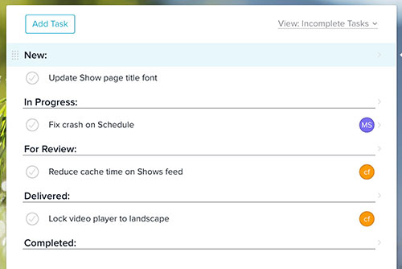

#Table of contents
* [Vacation](#vacation)
* [Hours](#hours)
* [Source control](#sourcecontrol)
* [Asana workflow](#asanaworkflow)
* [Branding](#branding)
* [Philanthropy](#philanthropy)

## <a name="vacation">Vacation</a>
For legal reasons, the official vacation is listed as 4 weeks a year. That restriction is really only there for legal protection. We believe everyone is a responsible adult and understands what is reasonable. If you can't then you shouldn't be here ;).  We don't have set holidays off. Everyone has different beliefs, different interests, so it is really up to you to decide when you want to be off.

Given we are working on clients with deadlines, we just ask to give proper notice when you are going to be out. If you are in the middle of a project and everyone is depending on you, it probably isn't a good idea to disappear for a week on short notice. Again, this should be obvious and isn't asking much. There is a lot of flexibility, we just ask you to handle it responsibly.

Holidays that most of the office are generally out (but aren't required) are:

* Christmas
* Thanksgiving
* Good Friday
* July 4th
* Memorial day
* Labor day

## <a name="hours">Hours</a>
We use [Freckle](http://dreamsocket.letsfreckle.com) for all recording all hours. You must be granted an account to access it. In addition, each project has access restrictions. Please ask if you need access granted to the system or a project. 

Make sure to log time against the correct client/project. If you are unsure, ask. 

**Logging time**

When logging hours always use the built in Timer to stop and start your time. On the website, this can be found in the left hand nav. If you are on a Mac, we encourage you to [download it](https://itunes.apple.com/us/app/freckle/id879917538?mt=12&ign-mpt=uo%3D4) from the Mac App Store.

Always use the timer and accurately record your time. We work on time and materials with most of our projects. If you are recording hours while you aren't working that will add up over time. Say you recorded an extra 30 minutes a day, that is 2.5 hours a week or 10 hours a month. We don't want to overbill our clients. Ethics and honesty are at the core of what we do, so please make sure to accurately reflect that in what you record. There aren't internal incentives or penalizations based on how much you charge, but rather on whether you get your work done.  

**Tagging time**

Freckle always you to tag your hours with a hash tag. 

The 2 general tags we typically use are: 

* \#admin - for meetings, emails, etc 
* \#development - all coding. 

When working on a project try to do additional tagging when you can to help identify what you worked on. The main benefit with this is being able to identify it for future reference. This helps a TON when we go an do estimates for a project. If you know that a specific component or section took XXX hours and you are going to have to do something similar in the future, you have a good idea of what it takes with that granularity. It also helps if we or the client wants to identify how long a specific piece took. NOTE, these are additional tags to #development. When making these additional tags, the most important thing is that they are descriptive of the task and are consistent. If more than one person is working on a specific task, communicate between the group so everyone is tagging it the same.

## <a name="sourcecontrol">Source control</a>
At Dreamsocket we use both Github and Bitbucket for source control. All our repositories are currently Git based. We use Github for projects for all our public repos and where we need to grant access to a large number of people on a project. We use Bitbucket for the majority of our repos where we have a lot more projects, but fewer people working on them.

If you are a Dreamsocket employee, you will be granted team access to all repos on both systems. If you are a contractor, you will be added to a team that relates to the work you are doing and granted specific access to repos for that team.

When doing check ins, we have a very simple tagging system for all change notes.

Use the following tags:

* [ADMIN] - when initially adding a repo
* [NEW] - adding a new feature, file, etc
* [FIX] - corrected something that was broken
* [CHG] - a change to an existing item has been made
* [DEL] - when removing an item, file, etc

Although you can see files changed by just looking at the change log, that is only a file based record. It requires a lot inference to figure out things that were changed, removed, added, etc. By using these simple tags, the change notes provides a very quick snapshot of what was modified for that commit.

## <a name="asanaworkflow">Asana workflow</a>
At Dreamsocket we use [Asana](http://asana.com) for internal project management. We use Asana's [sections](https://asana.com/guide/help/projects/sections) feature to implement a project management workflow.

The rules for each section are:

### New
Staging area for new tasks that we haven't started progress on. Some tasks will be unassigned, awating more details and others will be assigned awaiting the start of development.

### In Progress
Tasks that are currently in progress. Tasks should be moved here from New once progress is started. 

### For Review
Tasks for internal review. Once a work is completed on a task, move it here and assign back to the task creator or someone else for QA.

### Delivered
Tasks that have been delivered to the client. Send back to In Progress if more work is needed and assign to the correct person.

### Completed
Tasks that the client has signed off on. The task will finially be marked as completed once it goes live.

## <a name="branding">Branding</a>
If you ever need to brand a document, presentation, site, etc with the Dreamsocket brand, please following the [branding guidelines](branding/ds.brandmark.guidelines.pdf). These guidelines illustrate how to use the brandmark and provide different colorways depending on whether you are using the mark in a light or dark situation.

There are vector based brandmark files for working with a vertical or horizontal mark in either a light or dark situation. Please look thru the [available files](branding/brandmark) in relation the [guidelines](branding/ds.brandmark.guidelines.pdf) to pick which is best for your situation.

## <a name="philanthropy">Philanthropy</a>
Dreamsocket was founded with the aid and support of a great number of generous individuals. We have been fortunate enough to have a community like this that has allowed us to thrive and become who we are. We want to provide the same opportunities to others and genuinely make the world a better place. 

We view our employees, vendors and customers as partners in our dreams. Therefore, we want to offer them the opportunity to participate in our vision of a better future for all humankind.

Through our philanthropy program, for every client, employee, or partner we work with thru the year, we will make a donation to a nonprofit charity of our partner's choosing that they feel will make a positive impact in the lives of others. 

The philanthropy form can be found [here](philanthropy/dreamsocket_philanthropy.pdf).

